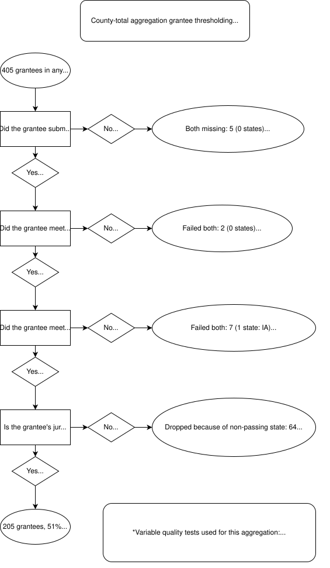
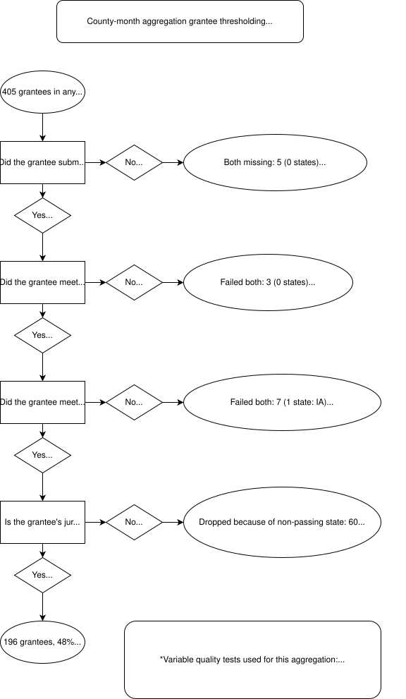

# Methods

Here, we detail our data cleaning and processing methodology. For more details on the raw data, please see [this section](index.md#data-sources) from the project's 'About' page.

## Step 0: Grantee metadata

We began by preparing grantee metadata to be used in all subsequent steps. We took as our input a structured list of ERA1 and ERA2 grantees compiled by the National Low Income Housing Coalition (NLIHC).

We also generated geographic crosswalks between grantees and Census geographies, as well as between city-level grantees and county-level grantees.

## Step 1: Geocode

The ERA1 closeout PHPDHF as well as the ERA2 Q4 and reachback PHPDFs had geocoding outputs in a separate file. In this step, we compared the payment files and their corresponding geocodes, and verified that all rows join.

The following number of rows were present in the payments file but not in the geocoded file: we geocoded these ourselves, using the Census geocoder.

- ERA1 closeout: 77 rows (87.03% successfully geocoded)
- ERA2 Q4: 24,394 rows (99.95% successfully geocoded)
- ERA2 reachback: 0 rows (all rows already geocoded by HUD)

The other ERA2 PHPDFs already had geocodes appended to the payment data in a single file. 

## Step 2: Initial validation

In this step, we performed preliminary data-cleaning steps to normalize the formatting of the data. Each PHPDF (one for ERA1 and four for ERA2) was processed independently.

-   Standardizing variable names
    -   Ensuring compatibility between PHPDF files
-   Standardizing variable types
    -   Treating GEOIDs as appropriately left-padded strings
    -   Converting dates to ISO 8601 format
-   Standardizing NA strings
    -   Turning variously-encoded missing values into proper NAs
-   Dealing with garbled character encodings in source data
-   Standardizing grantee identification
    -   Correcting misspellings and errors
    -   Validating grantee IDs
-   Removing sentinel values (e.g., totals rows)
-   Correcting shifted columns (some grantees submitted data with columns in a different order than required)
-   Joining relevant geocode data from geocode file

## Step 3: Deduplication

In this step, we deduplicated each PHPDF independently.

In the data, three patterns of duplication were discernible, so we deduplicated in three stages.

### Across-grantee

Identical payments could be reported by more than one grantee. For the purposes of this stage, 'identical' means having the same values across:

-   address_line_1
-   address_line_2
-   address_line_3
-   city_name
-   state_code
-   zip5
-   zip4
-   payee_type
-   type_of_assistance
-   amount_of_payment
-   date_of_payment
-   start_date
-   end_date
-   program

How such payments were deduplicated depended on the cause of the duplication.

If the duplication was due to grantees having overlapping geographies, all records made by the smallest jurisdiction were kept and others dropped (e.g., keep records from the City of Pittsburgh grantee, drop records duplicated in the Allegheny County grantee).

If the duplication was due to misattribution of records to grantees with similar names, we dropped the records attributed to the wrong grantee, by inspecting the location of the payments (e.g., records attributed to Cleveland County, OK but were actually made by Cleveland, OH).

### Across-file

In a given PHPDF, a grantee could submit data to Treasury in multiple files. In some cases (very commonly in the ERA1 PHPDF), multiple files with near-identical contents were included from the same grantee. If identical records (using the same definition as above) were included in multiple files from the same grantee, we kept all records from the file with the largest number of records, and dropped duplicated records from all other files of the same grantee.

### Within-file

Records could also be duplicated within a given file from a given grantee. Here, we define identical records more conservatively, since missing data across the identifying columns mean that multiple distinct payments could look the same if they are all missing critical elements like street address. Therefore, if any of the following variables were NA, we gave each NA value a temporary unique value to avoid using these missing values in identifying duplication.

-   address_line_1
-   payee_type
-   type_of_assistance
-   amount_of_payment
-   date_of_payment
-   start_date

Within a given file from a given grantee, we keep the duplicate record with the lowest row number and drop all others.

### Extent of duplication

We report the following figures to illustrate the extent of de/duplication in each PHPDF:

- ERA1 closeout: 5,621,334 rows dropped (42%)
    - The large percentage here is due to duplicate PHPDFs with different names stored in Treasury’s reporting system
- ERA2 Q4: 54,293 rows dropped (0.9%)
- ERA2 Q2: 12,261 rows dropped (0.3%)
- ERA2 Q1: 98,317 rows dropped (2%)
- ERA2 reachback: 74 rows dropped (\~0%)

## Step 4: County imputation

In this step, we imputed county locations for payments that were missing a geocoded county.

Before imputation, 54,831 rows in the ERA1 PHPDF and 265,703 rows in the ERA2 (2023 Q4) PHPDF were missing county location.

Our imputation process assigned county locations to 29,445 rows previously missing county locations in ERA1 (54% of missing-county records) and to 123,788 rows for ERA2 (47%).

For each PHPDF, we used two methods:

### Use grantee geography for counties/single-county cities

For county-level grantees and city-level grantees whose jurisdictions were included in only one geographic county, we imputed as the county of payment the geographic county of the grantee's jurisdiction.

### Use City + ZIP: county crosswalk for states

For state programs, this was a bit more complicated. We utilized a [ZIP code-county crosswalk](https://www.huduser.gov/portal/datasets/usps_crosswalk.html) from HUD.

First, we determined which zip codes in the crosswalk fell into just one county. Similarly to above, we then joined the single-county zips to the payment files, but this time, by zip code and state. We found that joining by city was too limiting, as the cities were described differently in each file (for example, the same address could be described as being in Las Vegas or North Las Vegas).

The next, slightly more complicated step, was to join zip codes that fell within multiple counties. To be able to join one-to-one, we filtered the HUD county-zip crosswalk file to include counties where 95% of a zip code was within the county. After that, we could simply join by zip code and state.

### Coalesce `county_geoid`

We then coalesced from `geocode_county_geoid` and `imputed_county_geoid`. If a payment already had a value for `geocode_county_geoid`, then we kept that value. If not, it took on the value of `imputed_county_geoid`. We used this coalesced county assignment variable in all subsequent data processing steps.

## Step 5: Variable checks

In this step, we generated data validation metrics for each PHPDF.

We first generated a series of variable-specific data quality checks, testing each row for:

-   Whether the record was within the geographic jurisdiction of the grantee
-   Whether the record was locatable to a specific county
-   Whether the payment amount was recorded, and if so, whether it was negative, zero, or anomalously large
    -   We defined 'anomalously large' as an amount exceeding the 99.9th percentile value of all records in ERA1 closeout and ERA2 Q4 (which was $73,541).
-   Whether the date of payment was recorded, and if so, whether it was impossibly early (before January, 1, 2021 for ERA1, or before March 1, 2021 for ERA2) or late (after December 31, 2022 for ERA1, or after the end of the reporting quarter for ERA2)
-   Whether the payee type (landlord, utility, tenant) was recorded
-   Whether the assistance type (rent, utilities, other) was recorded
-   Whether the record included a valid address
-   The geocoding quality of the record, as given by HUD's geocoding process

For each aggregation type, we selected a subset of these variable quality tests to calculate grantee-level variable quality.

- For the county-month dataset, we employed the first 4 tests
- For the county-total dataset we imposed the first 3 tests

For each grantee, we calculated the percentage of its records that met all applicable variable quality tests for the relevant aggregation scenario.

For each grantee, we also calculated the percentage of its aggregate spending in the PHPDF compared to:

- Its total allocation for the applicable program (ERA1 or 2), inclusive of any reallocations 
- The amount reported in Treasury's publicly released aggregate summary reporting, which was itself compiled from aggregate reporting submitted by grantees to Treasury
- The amounts in the above bullet, but calculated at the state level (i.e., PHPDF spending added together for all grantees in a state, divided by aggregate reporting together for all grantees in a state)

## Step 6: Thresholding

In this step, we specified acceptable data quality thresholds for all grantees.

First, for each PHPDF, we calculated whether each grantee met the following thresholds:

- Variable quality: At least 79% of records had acceptable data across all variables needed for the applicable aggregation type (see Step 5 above for details on the tests)
- Spending completeness: The aggregate sum of the grantee's payments (excluding negative payments) were:
	- Between 80% and 110% of its allocation (ERA1) or 50% and 110% of its allocation (ERA2); or
	- If between 50% and 80% of its allocation (ERA1) or 25% and 50% of its allocation (ERA2), the reported spending was within 20% of the aggregate spending as reported to Treasury, either individually or for all grantees in the state together; or
	- Confirmed by Treasury to be an accurate reflection of low spending by the grantee
	
Second, we picked an ERA2 PHPDF source for each grantee, taking the most recent PHPDF for which a grantee passed (if any quarters passed) or the most recent PHPDF we had data for the grantee (if all quarters failed).

Third, for any grantees which participated in either program (n = 405), we joined the diagnostic data for ERA1 and ERA2 to derive overall threshold checks. A grantee passed if it:

- Submitted data for all programs it participated in 
- Passed the variable quality threshold for all programs it participated in 
- Passed the spending completeness threshold for all programs it participated in 

Fourth, we applied a geographic threshold: if an otherwise passing grantee significantly overlapped in the area of its jurisdiction with a failing grantee, then it failed this threshold. This was done because, in geographic areas served by multiple grantees, missing or bad-quality data from one grantee may have impacted a significant percentage of ERA activity in that geographic area overall.

We defined 'significantly overlap' as: more than 20% of the population of the geographic area served by the passing grantee being located in the overlap(s) with the geographic area(s) served by non-passing grantee(s). This was always taken to be the case for county and city grantees vis-à-vis their state grantees.

Flowcharts illustrating these thresholding steps and the number of grantees dropped at each juncture are available below.

## Step 7: Pre-aggregation

In this step, we prepared the final data to be aggregated.

First, we bound the ERA1 data together with the ERA2 data. We selected the vintage of the ERA2 data by each grantee, as specified in Step 6. 

Second, we identified geographic counties with coverage issues due to incomplete grantee coverage. For example, if the Cook County, IL, grantee failed, any payments that the State of Illinois grantee made in Cook County should also drop. Note that this screening of counties at the *geographic* level was in addition to the screening of counties/cities at the *grantee* level in Step 6.

Third, we filtered the joined data to only include the records to be included in the final aggregation. Namely, we only kept records where:

- The grantee passed all Step 6 thresholds
- The record was assigned to a county
- The county did not fall out due to the geographic screening described above
- The record passed all variable-level checks necessary for the applicable aggregation type

Fourth, we constructed unique address IDs. To do this, we first extracted unit number information from the following fields, in order of availability:

- Geocoded address unit number
- Address line 2/3
- Address line 1

We then assigned a unique ID to each unique concatenated value of:

- Geocoded address 
	- If geocoded address was missing, we used the original address if available
	- If there was no address at all, we used the record's row number
- Unit number
- Geocoded ZIP code
- Geocoded state

## Step 8: Aggregation

In this step, we performed the final aggregation.

Taking the data output from the previous step, we grouped the data by variables identifying each cell in the final output (e.g., county GEOID and payment month for the county + month aggregation), then calculated two quantities for each cell:

-   The sum of payment amounts
-   The number of unique assisted addresses

We then suppressed cell values where the number of unique assisted addresses is less than 11, and the corresponding payment amount sum. The suppressed values are encoded with the value `-99999`.

# Codebase

The R scripts used to process the data (as described above) may be found in our [project codebase repository](https://github.com/housinginitiative/era-county-level-dataset-codebase).